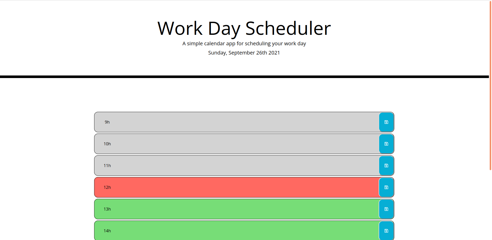

# Daily Planner

This is an application that allows the user to plan important events in their day using time blocks of one hour. The hour blocks are styled according to whether they are in the past (grey), present (red), or future (green). Every minute the app checks to see if the hour has changed and updates the styling as required. At the beginning of every day, all time blocks are cleared. Time blocks persist through local storage. 

application link: https://maplesyrupman.github.io/daily-planner/ 
github repo: https://github.com/maplesyrupman/daily-planner/

